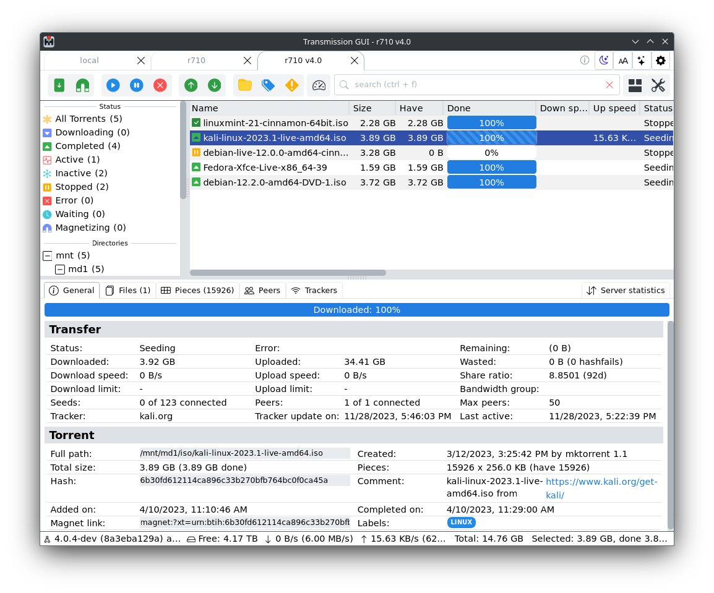
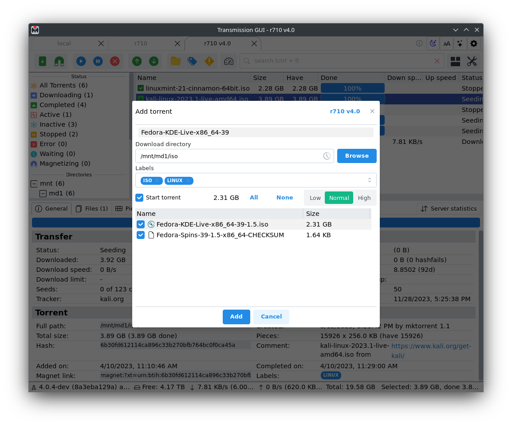
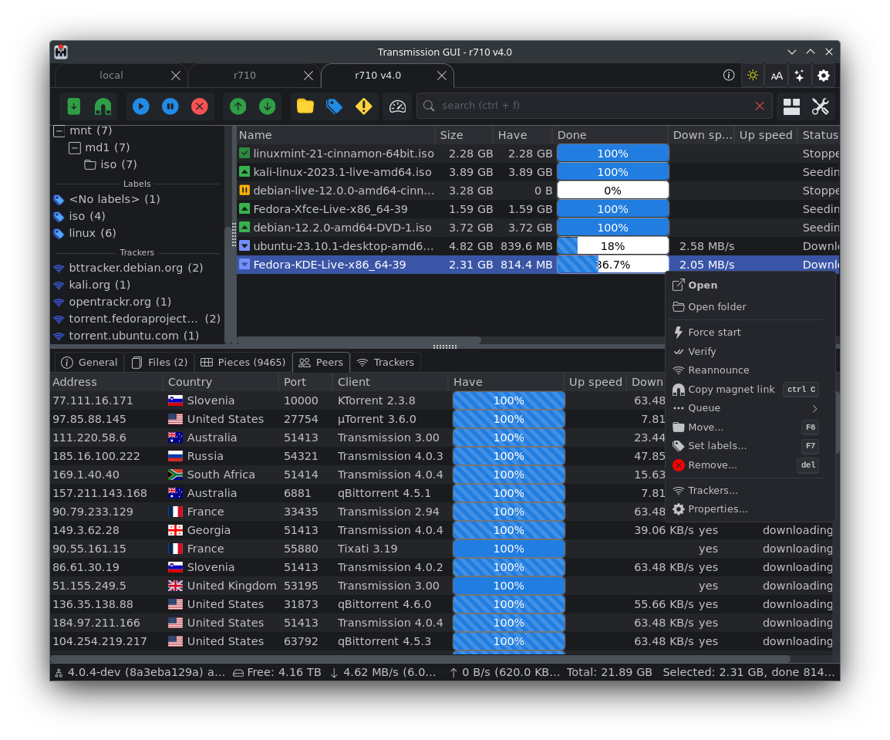
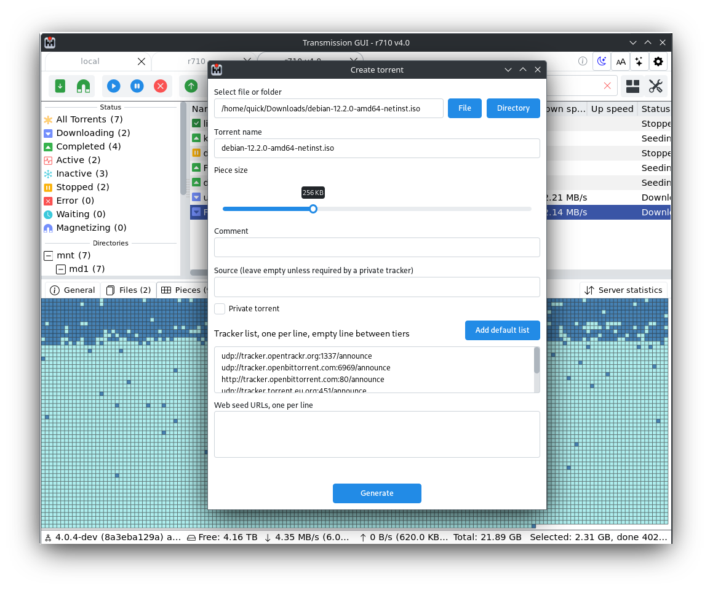
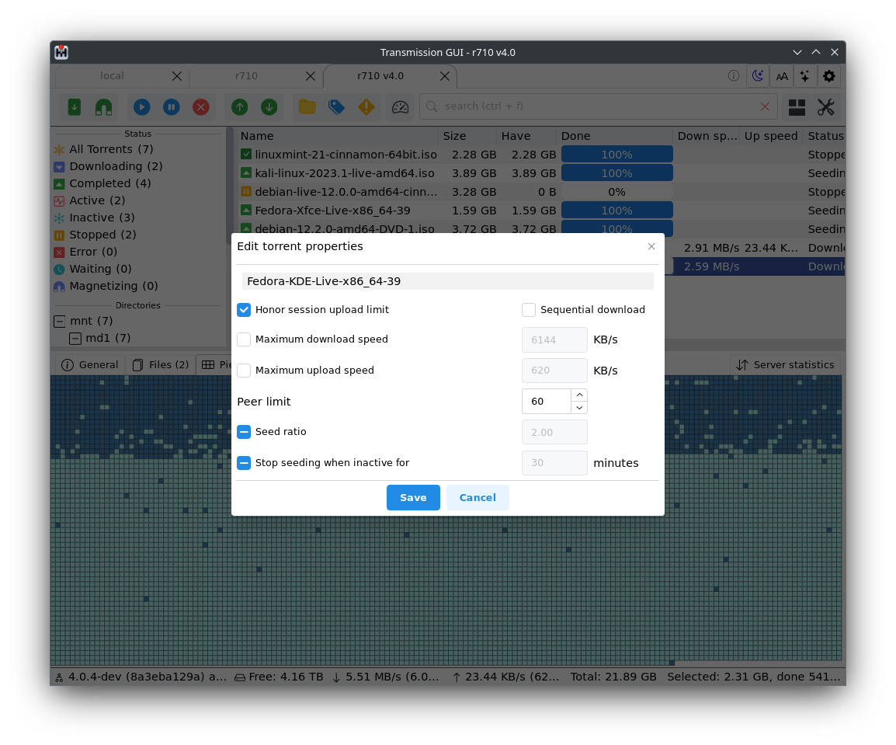
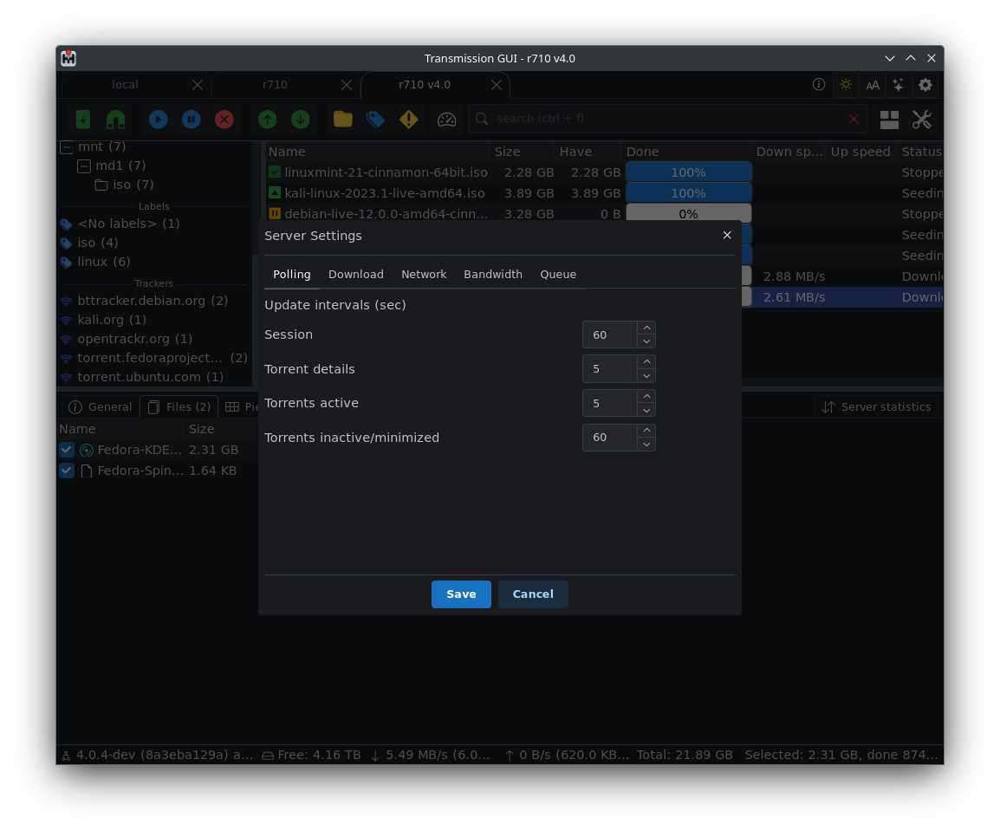

Title: TrguiNG
Date: 2023-11-28 10:20
Category: Software
Tags: transmission, GUI, torrents
Slug: trguing
Authors: qu1ck
Summary: TrguiNG - universal UI for transmission torrent daemon

You can use this program in 2 ways: as a native Windows/Linux/Mac app and as a web gui served by transmission itself by setting $TRANSMISSION_WEB_HOME environment variable to point to TrguiNG web assets.

Features:

* Multi tabbed interface for concurrent server connections (native app only)
* Torrent creation with fast multi threaded hashing (native app only)
* Powerful torrent filtering options
* Efficient network usage
* Configurable path mappings to directly access torrent files if their location is mounted locally (native app only)
* Latest transmission features support: labels, bandwidth groups, sequential download
* Dark/light/custom theme support

### Screenshots

